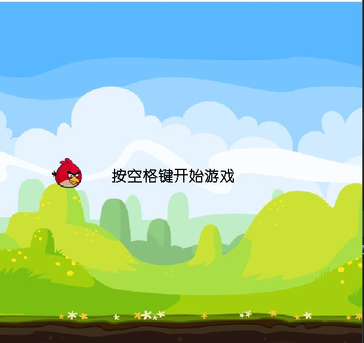
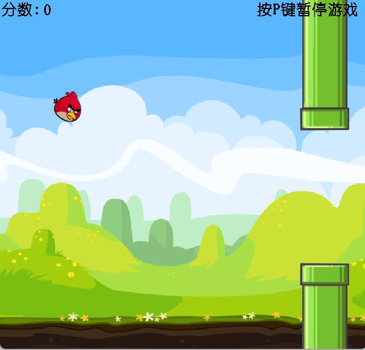
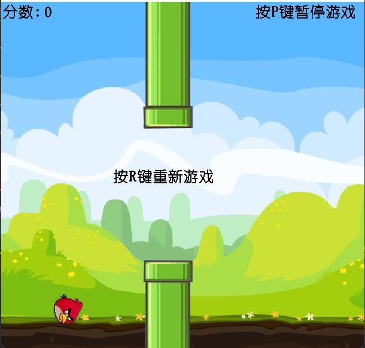

# FlyBird
## 基于多线程 java绘制设计的游戏
## 基本思路：
    1.创建所需对象  把基本背景绘制出来
    2.开始线程 使小鸟动起来
    3.键盘监控 space 使小鸟跳跃
    4.旋转
    5.界面控制
    6.管道的添加
    7.管道的运动
    8.碰撞判定
## 效果展示：
### 开始界面：

### 游戏过程及游戏暂停

### 游戏结束
